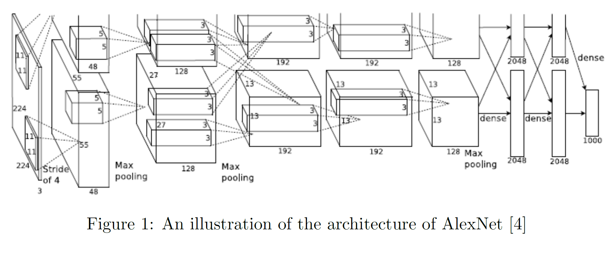
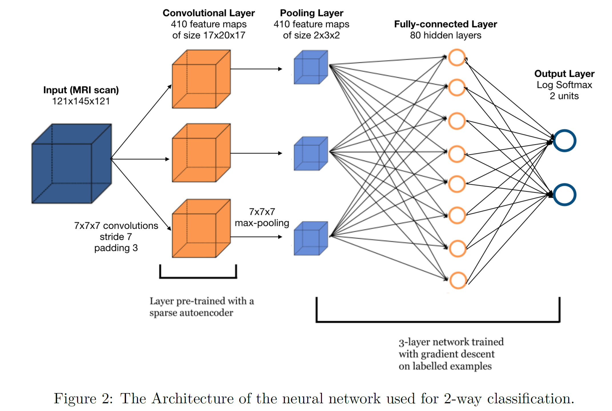
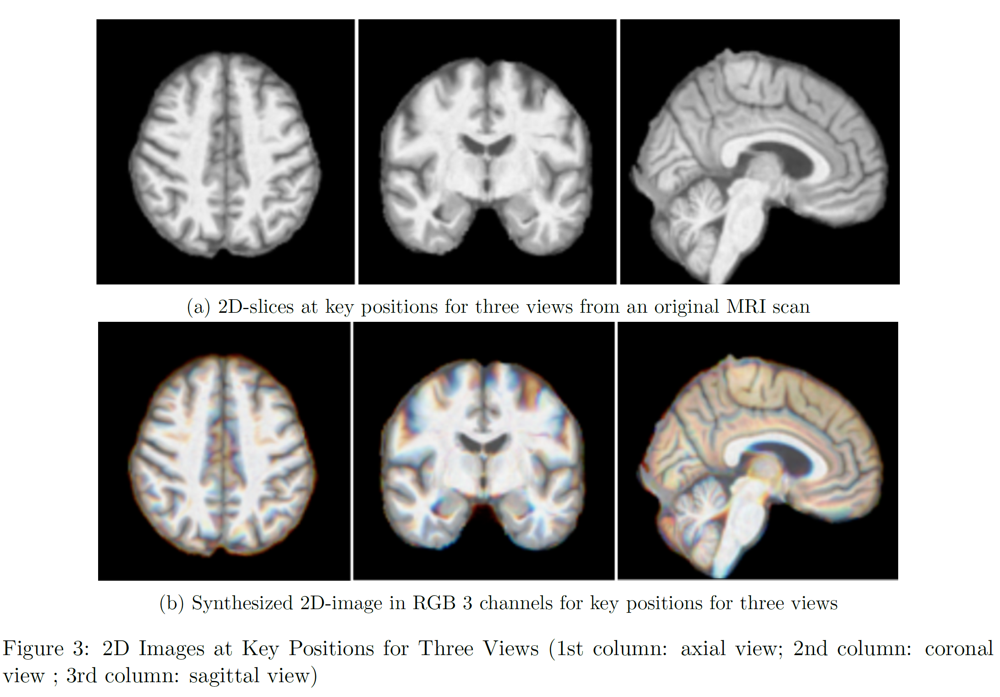
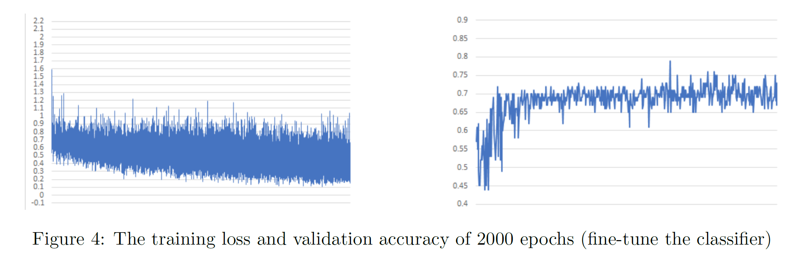
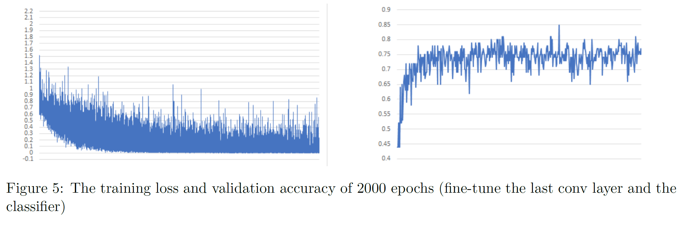
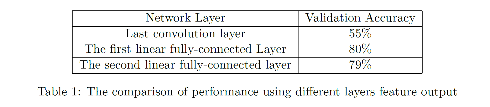

# AD-Prediction

Convolutional Neural Networks for Alzheimer's Disease Prediction Using Brain MRI Image

## Abstract
Alzheimers disease (AD) is characterized by severe memory loss and cognitive impairment. It associates with significant brain structure changes, which can be measured by magnetic resonance imaging (MRI) scan. The observable preclinical structure changes provides an opportunity for AD early detection using image classification tools, like convolutional neural network (CNN). However, currently most AD related studies were limited by sample size. Finding an efficient way to train image classifier on limited data is critical. In our project, we explored different transfer-learning methods based on CNN for AD prediction brain structure MRI image. We find that both pretrained 2D AlexNet with 2D-representation method and simple neural network with pretrained 3D autoencoder improved the prediction performance comparing to a deep CNN trained from scratch. The pretrained 2D AlexNet performed even better (**86%**) than the 3D CNN with autoencoder (**77%**).

## Method
#### 1. Data
In this project, we used public brain MRI data from **Alzheimers Disease Neuroimaging Initiative (ADNI)** Study. ADNI is an ongoing, multicenter cohort study, started from 2004. It focuses on understanding the diagnostic and predictive value of Alzheimers disease specific biomarkers. The ADNI study has three phases: ADNI1, ADNI-GO, and ADNI2. Both ADNI1 and ADNI2 recruited new AD patients and normal control as research participants. Our data included a total of 686 structure MRI scans from both ADNI1 and ADNI2 phases, with 310 AD cases and 376 normal controls. We randomly derived the total sample into training dataset (n = 519), validation dataset (n = 100), and testing dataset (n = 67).

#### 2. Image preprocessing
Image preprocessing were conducted using Statistical Parametric Mapping (SPM) software, version 12. The original MRI scans were first skull-stripped and segmented using segmentation algorithm based on 6-tissue probability mapping and then normalized to the International Consortium for Brain Mapping template of European brains using affine registration. Other configuration includes: bias, noise, and global intensity normalization. The standard preprocessing process output 3D image files with an uniform size of 121x145x121. Skull-stripping and normalization ensured the comparability between images by transforming the original brain image into a standard image space, so that same brain substructures can be aligned at same image coordinates for different participants. Diluted or enhanced intensity was used
to compensate the structure changes. the In our project, we used both whole brain (including both grey matter and white matter) and grey matter only.

#### 3. AlexNet and Transfer Learning
Convolutional Neural Networks (CNN) are very similar to ordinary Neural Networks. A CNN consists of an input and an output layer, as well as multiple hidden layers. The hidden layers are either convolutional, pooling or fully connected. ConvNet architectures make the explicit assumption that the inputs are images, which allows us to encode certain properties into the architecture. These then make the forward function more efficient to implement and vastly reduce the amount of parameters in the network.

#### 3.1. AlexNet
The net contains eight layers with weights; the first five are convolutional and the remaining three are fully connected. The overall architecture is shown in Figure 1. The output of the last fully-connected layer is fed to a 1000-way softmax which produces a distribution over the 1000 class labels. AlexNet maximizes the multinomial logistic regression objective, which is equivalent to maximizing the average across training cases of the log-probability of the correct label under the prediction distribution. The kernels of the second, fourth, and fifth convolutional layers are connected only to those kernel maps in the previous layer which reside on the same GPU (as shown in Figure1). The kernels of the third convolutional layer are connected to all kernel maps in the second layer. The neurons in the fully connected layers are connected to all neurons in the previous layer. Response-normalization layers follow the first and second convolutional layers. Max-pooling layers follow both response-normalization layers as well as the fifth convolutional layer. The ReLU non-linearity is applied to the output of every convolutional and fully-connected layer. 

The first convolutional layer filters the 224x224x3 input image with 96 kernels of size 11x11x3 with a stride of 4 pixels (this is the distance between the receptive field centers of neighboring neurons in a kernel map). The second convolutional layer takes as input the (response-normalized and pooled) output of the first convolutional layer and filters it with 256 kernels of size 5x5x48. The third, fourth, and fifth convolutional layers are connected to one another without any intervening pooling or normalization layers. The third convolutional layer has 384 kernels of size 3x3x256 connected to the (normalized, pooled) outputs of the second convolutional layer. The fourth convolutional layer has 384 kernels of size 3x3x192 , and the fifth convolutional layer has 256 kernels of size 3x3x192. The fully-connected layers have 4096 neurons each.

#### 3.2. Transfer Learning
Training an entire Convolutional Network from scratch (with random initialization) is impractical[14] because it is relatively rare to have a dataset of sufficient size. An alternative is to pretrain a Conv-Net on a very large dataset (e.g. ImageNet), and then use the ConvNet either as an initialization or a fixed feature extractor for the task of interest. Typically, there are three major transfer learning scenarios: 

**ConvNet as fixed feature extractor:** We can take a ConvNet pretrained on ImageNet, and remove the last fully-connected layer, then treat the rest structure as a fixed feature extractor for the target dataset. In AlexNet, this would be a 4096-D vector. Usually, we call these features as CNN codes. Once we get these features, we can train a linear classifier (e.g. linear SVM or Softmax classifier) for our target dataset. 

**Fine-tuning the ConvNet:** Another idea is not only replace the last fully-connected layer in the classifier, but to also fine-tune the parameters of the pretrained network. Due to overfitting concerns, we can only fine-tune some higher-level part of the network. This suggestion is motivated by the observation that earlier features in a ConvNet contains more generic features (e.g. edge detectors or color blob detectors) that can be useful for many kind of tasks. But the later layer of the network becomes progressively more specific to the details of the classes contained in the original dataset. 

**Pretrained models:** The released pretrained model is usually the final ConvNet checkpoint. So it is common to see people use the network for fine-tuning.

#### 4. 3D Autoencoder and Convolutional Neural Network
We take a two-stage approach where we first train a 3D sparse autoencoder to learn filters for convolution
operations, and then build a convolutional neural network whose first layer uses the filters learned with
the autoencoder. 

#### 4.1. Sparse Autoencoder
An autoencoder is a 3-layer neural network that is used to extract features from an input such as an image. Sparse representations can provide a simple interpretation of the input data in terms of a small number of \parts by extracting the structure hidden in the data. The autoencoder has an input layer, a hidden layer and an output layer, and the input and output layers have same number of units, while the hidden layer contains more units for a sparse and overcomplete representation. The encoder function maps input x to representation h, and the decoder function maps the representation h to the output x.
In our problem, we extract 3D patches from scans as the input to the network. The decoder function aims to reconstruct the input form the hidden representation h.

#### 4.2. 3D Convolutional Neural Network
Training the 3D convolutional neural network(CNN) is the second stage. The CNN we use in this project has one convolutional layer, one pooling layer, two linear layers, and finally a log softmax layer. After training the sparse autoencoder, we take the weights and biases of the encoder from trained model, and use them a 3D filter of a 3D convolutional layer of the 1-layer convolutional neural network. Figure 2 shows the architecture of the network.

#### 5. Tools
In this project, we used Nibabel for MRI image processing and PyTorch Neural Networks implementation.

## Experiment and Results

#### 1. 2D AlexNet
#### 1.1. 2D image Slice 

For inputs to 2D neural network classifier, we used 2D-image slices from a 3D MRI scans. An 3D MRI image can be viewed in three angles, perpendicular to each of three standard image coordinate axis: axial view, coronal view, and sagittal view. With observations, we identified key positions within a 3D MRI whose corresponding 2D image could present a more discernible morphology structure, in terms of the magnitude of brain atrophy, between AD cases and normal controls. (We will use the term key position referring to the position we just described) Because of the standard image space, the key position has exact same position index across different images: position index 78 for axial view; 79 for coronal view; and 57 for sagittal view Figure 3a. In the training phase, a slice index was randomly extracted at around the key positions for each of the three views, within a range of pm10 (slices). To constructed a RGB
color image, we concatenate the key position slice, one slice one index before the key position, and one slice one index after the key position, into R, G, and B channels respectively(Figure 3b). By doing so, we hope the synthesized image could incorporate more spatial information and have some robustness.
For validation and testing, we constructed the 2D-slice images at the exact key positions as described above for each of the three views. For each testing MRI image, three 2D-slice images (from the three views) were sequentially passed into the trained network. A final predicted label was decided by majority vote from the three 2D-slice images, that is if at least two of the three 2D images support a AD label, then the MRI scan will be predicted as "having AD".

#### 1.2. Primary Structure of our AlexNet
As mentioned in previous section, due to the very limited number of training data, it is impossible to train the AlexNet from scratch. Fortunately, as indicated in [13] that transferring features even from distant tasks can be better than using random features. And initializing a network with transferred features from almost any number of layers can produce a boost to generalization that lingers even after fine-tuning to the target dataset. Thus, we decide to use a set of initial parameters that are pretrained on the ImageNet. Different from the original AlexNet architecture, our second convolutional layer takes input from the first convolutional layer and filters it with 256 kernels of size 5x5x64. The third convolutional layer has 384 kernels of size 3x3x192 connected to the outputs of the second convolutional layer. The fourth convolutional layer has 384 kernels of size 3x3x384, and the fifth convolutional layer has 256 kernels of size 3x3x256. To adapt the output of the pretrained AlexNet model, we add an extra fully-connected layer with 1000 neurons and a Log-Softmax layer on the top of the original model in order to compute the negative log-likelihood loss.

**Fine-Tuning**
In this part, the optimizer we use is the Adam optimizer, and the learning rate is set to 1e-4. We run 2000 epochs on both the training set and the validation set.

**Fine-tune the linear fully-connected layers**
Since the pretrained dataset (ImageNet) is so different from our new dataset, and as we know the higher layers of the network are more specific to the details of the classes contained in the original dataset. So, we not only replace the last fully-connected layer but also fine-tune all the linear fully-connected layer (the classifier).

To do this, we only backpropagate to the first linear fully-connected layer, and keep the weights in earlier layers (the convolution layers). Figure 4 shows the training loss and the validation accuracy on this 2000 epochs run. In this experiment, the best validation accuracy we achieve is 79%. 

**Fine-tune the last convolution layer and the linear fully-connected layers**
Based on the observation that higher layer of the network contains more dataset specific features. We don't know whether only fine-tune the classifier (linear fully-connected layers) is a wise choice. Therefore, inspired by [15], we conduct experiment to fine-tune the network from the last convolution layer to the last output layer. Since we dont want to distort the initial parameters, as stated before, the learning rate we use is 1e??4, which is proved to generate better performance than that of 1e??3. Figure 5 below shows the training loss and the validation accuracy on this 2000 epochs run. In this experiment, the best validation accuracy we achieve is 85%, which is 6% higher than the previous experiment. Furthermore, as we know that the network parameter initialization would affect the performance. Follow [16], we use Xavier Initialization to set the initial parameter of the last (extra added) fully-connected layer. The rest steps are the same as the previous one. We observe that the best validation accuracy increases 1% (86%) and the overall performance is better than the one without \Xavier Initialization.

#### 1.3. Combine AlexNet with Linear SVM
As stated in section 2.3.2, we can regard AlexNet as a fixed feature extractor, and use SVM to perform the final classification. In this section, we conduct experiments to compare the performance of the combination of AlexNet and SVM when using different layers output features. 

Table 1 below shows the comparison. From the table above, we can see that using features come from the first linear fully-connected layer would achieve the best result. 

#### 2. 3D Autoencoder with convolutional neural network

**Training of 3D Sparse Autoencoder**
The 3D sparse autoencoder extracts features from a 7x7x7 patch of the 3D MRI scan, and transfer each patch-feature into a sparse vector with size of 410. To train the autoencoder, we used 300 3D MRI scans from the training dataset and randomly draw 1000 7x7x7 patches from each of the 3D scan. Empty patch (sum of all the voxels in the patch is zero) was replaced with a new draw. The autoencoder was trained through 200 epochs. Figure 6a shows the change of training loss of autoencoder. 

**3-layer convolutional neural network with Auto-encoder**
The CNN architecture we use has been illustrated in Figure 2. Besides, we add dropout layers with percentage 50% to prevent the model overfit. We trained the model for 250 epochs and the training loss is shown in Figure 6b. The accuracy we get on validation set is 77%.

## Conclusion
Our results suggested that transfer learning is a potential suitable approach for training CNN classifier on a small scale training dataset for AD prediction based on structure brain MRI scans. Pretrained convolutional layers that could extract generic image features, e.g convolutional layers in the AlexNet which were pretrained on ImageNet, could provide good input features for subsequent neural network for AD classification.


## How to run the code

#### 1. train the model:
```
python main_alexnet.py --optimizer Adam --learning_rate 1e-4 --save AlexNet-fine-tune-fc-last-conv-lr1e-4 --batch_size 16 --epochs 200 --gpuid 0
or
python main_autoencoder.py --batch_size 32 --num_classes 2 --epochs 200 --gpuid 0
```


## Reference
[1] Langa KM. Is the risk of Alzheimer's disease and dementia declining? Alzheimers Res Ther. 2015;7:34.

[2] Hebert LE, Weuve J, Scherr PA and Evans DA. Alzheimer disease in the United States (2010-2050) estimated using the 2010 census. Neurology. 2013;80:1778-83

[3] Alzheimer Disease International: World Alzheimer report 2010: the global economic impact of dementia. 2010.

[4] Krizhevsky, Alex, Ilya Sutskever, and Geoffrey E. Hinton. Imagenet classification with deep convolutional neural networks. Advances in neural information processing systems. 2012.

[5] He, Kaiming, et al. Deep residual learning for image recognition. Proceedings of the IEEE conference on computer vision and pattern recognition. 2016.

[6] Korolev, Sergey, et al. Residual and Plain Convolutional Neural Networks for 3D Brain MRI Classification. arXiv preprint arXiv:1701.06643 (2017).

[7] Chen, Hao, et al. Voxresnet: Deep voxelwise residual networks for volumetric brain segmentation. arXiv preprint arXiv:1608.05895 (2016).

[8] He, Kaiming, et al. Identity mappings in deep residual networks. European Conference on Computer Vision. Springer International Publishing, 2016.

[9] Tajbakhsh, Nima, et al. Convolutional neural networks for medical image analysis: Full training or fine-tuning? IEEE transactions on medical imaging 35.5 (2016): 1299-1312.

[10] Poultney, Christopher, Sumit Chopra, and Yann L. Cun. Efficient learning of sparse representations with an energy-based model. Advances in neural information processing systems. 2007.

[11] Payan, Adrien, and Giovanni Montana. Predicting Alzheimer's disease: a neuroimaging study with 3D convolutional neural networks. arXiv preprint arXiv:1502.02506 (2015).

[12] Langa KM. Is the risk of Alzheimer's disease and dementia declining? Alzheimers Res Ther. 2015;7:34.

[13] Hebert LE, Weuve J, Scherr PA and Evans DA. Alzheimer disease in the United States (2010-2050) estimated using the 2010 census. Neurology. 2013;80:1778-83.

[14] Alzheimer Disease International: World Alzheimer report 2010: the global economic impact of dementia. 2010.

[15] Chester V. Dolph, Manar D. Samad and Khan M. Iftekharuddin. Classification of Alzheimers disease using structural MRI.

[16] Yosinski J, Clune J, Bengio Y, and Lipson H. How transferable are features in deep neural networks? In Advances in Neural Information Processing Systems 27 (NIPS 14), NIPS Foundation, 2014.

[17] Pan, Sinno Jialin, and Qiang Yang. A survey on transfer learning. IEEE Transactions on knowledge and data engineering 22.10 (2010): 1345-1359.

[18] Hosseini-Asl, Ehsan, Georgy Gimel'farb, and Ayman El-Baz. Alzheimer's Disease Diagnostics by a Deeply Supervised Adaptable 3D Convolutional Network. arXiv preprint arXiv:1607.00556 (2016).

[19] Glorot, Xavier, and Yoshua Bengio. Understanding the difficulty of training deep feedforward neural networks. Proceedings of the Thirteenth International Conference on Artificial Intelligence and Statistics. 2010.

[20] F. Liu, C. Shen. Learning Deep Convolutional Features for MRI Based Alzheimers Disease Classification. arXiv preprint arXiv:1404.3366, 2014.

[21] Sharif Razavian, Ali, et al. CNN features off-the-shelf: an astounding baseline for recognition. Proceedings of the IEEE conference on computer vision and pattern recognition workshops. 2014.

[22] Yosinski, Jason, et al. How transferable are features in deep neural networks? Advances in neural information processing systems. 2014.
